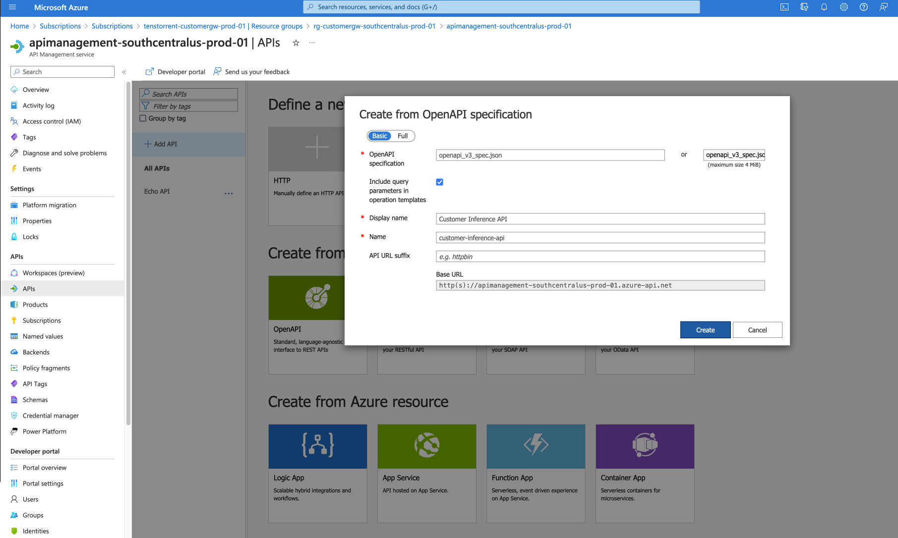
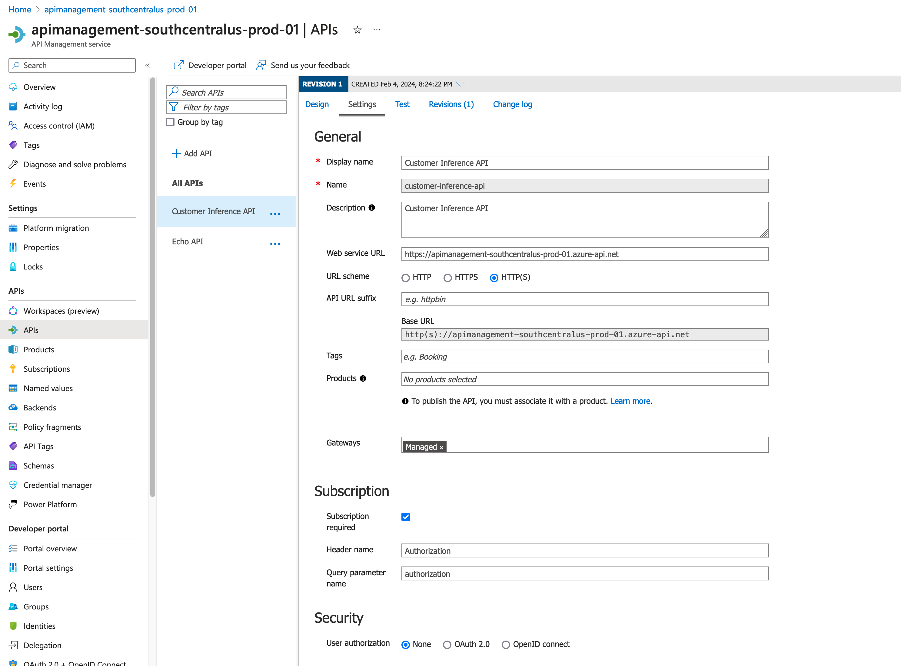
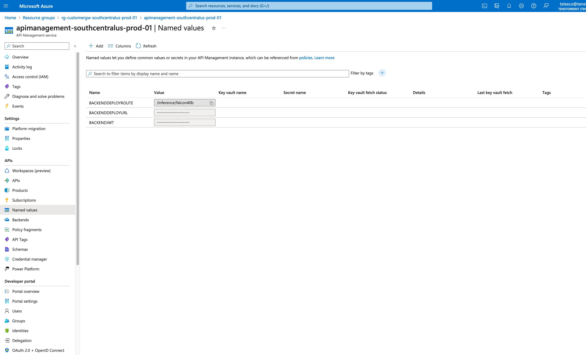
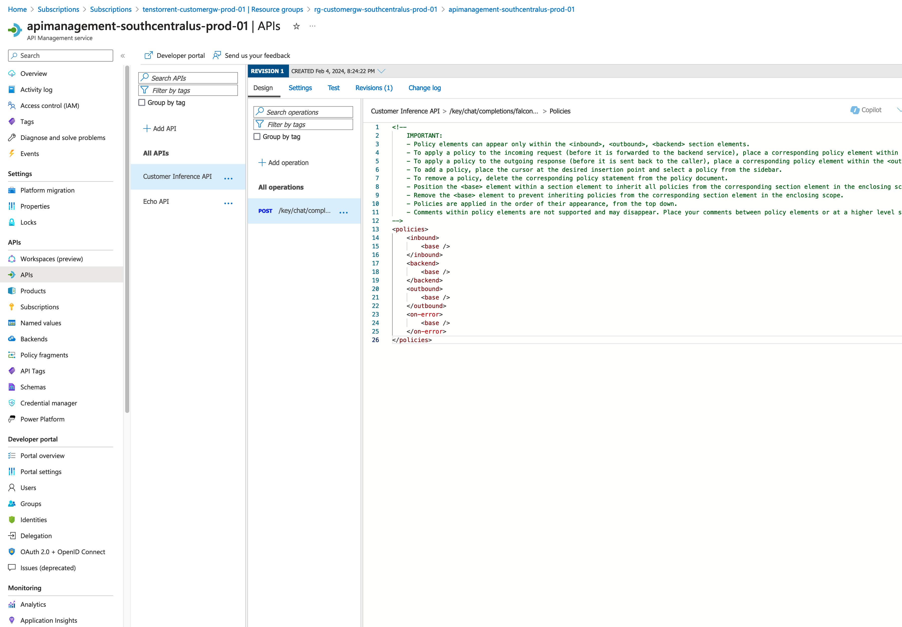
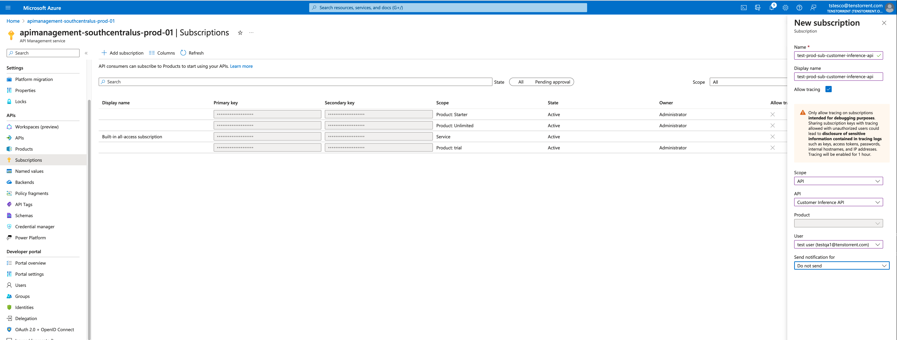

# Azure API Management (APIM) setup

1. Go to Azure portal -> Resource groups

    * rg-customergw-southcentralus-prod-01
    * apimanagement-southcentralus-prod-01

2. Create API: Go to APIs -> APIs -> Add API

    
    * Create from OpenAPI: upload file secpification
    * Display name: customer-inference-api
    * Name: customer-inference-api

3. Go to API Settings:

    
    * Subscription:
        * Header name: Authorization
        * Query parameter: authorization

3. Set Named values:

**note:** underscores "_" cannot be used in named values, only hypens "-" can be
* BACKEND-JWT: internal backend JWT
* BACKEND-URL: internal backend deployment URL
* BACKEND-ROUTE: internal backend deployment route for inference API, e.g. /inference/falcon40b


4. Set API Policies <>:


note: All operations may be selected, set the polices on the specific route, e.g. /key/chat/completions/falcon-40b-instruct
change polices in XML to:
```
<policies>
    <inbound>
        <base />
        <set-backend-service base-url="{{BACKEND-URL}}" />
        <set-header name="Authorization" exists-action="override">
            <value>Bearer {{BACKEND-JWT}}</value>
        </set-header>
        <rewrite-uri template="{{BACKEND-ROUTE}}" />
    </inbound>
    <backend>
        <forward-request http-version="2" timeout="300" fail-on-error-status-code="true" buffer-response="false" />
    </backend>
    <outbound>
        <base />
    </outbound>
    <on-error>
        <base />
    </on-error>
</policies>
```
__note__: it is critical that `buffer-response="false"` is set, otherwise streaming will not work.

5. Test on APIM console

Set Request Body:
```
{"text":"Human: is the AI model working?\n AI: ", "max_tokens": 16}
```
The response code should be 200 with up to 16 tokens of generated text.

6. Create test user:

for example: testqa1@tenstorrent.com

7. Create test subscription:

test-prod-sub-customer-inference-api
* click show/hide keys on the far right ... to get key

8. Test APIM end-to-end using the user's secondary key

The purpose of APIM having primary and secondary keys, which serve the same purpose, is to allow coordinated asynchronous key rotation with customers maintaining availability. i.e. customers can switch their APIs to use the other key, while the one they were previously using can be rotated.
```bash
export APIM_KEY=<secondary key>
export APIM_API_URL=<APIM url>, e.g. https://apimanagement-southcentralus-prod-01.azure-api.net/key/chat/completions/falcon-40b-instruct
curl ${APIM_API_URL} -H "Content-Type: application/json" \
-H "Authorization: ${APIM_KEY}" \
-d '{"text":"Human: count to 10 with newlines after each number\n AI: ", "max_tokens": 16}'
```
**note:** curl only prints the streamed response chunks when a newline is sent, without newlines the response will appear to be buffered by curl. Reading chunks in Python for testing does not have this limitation.
