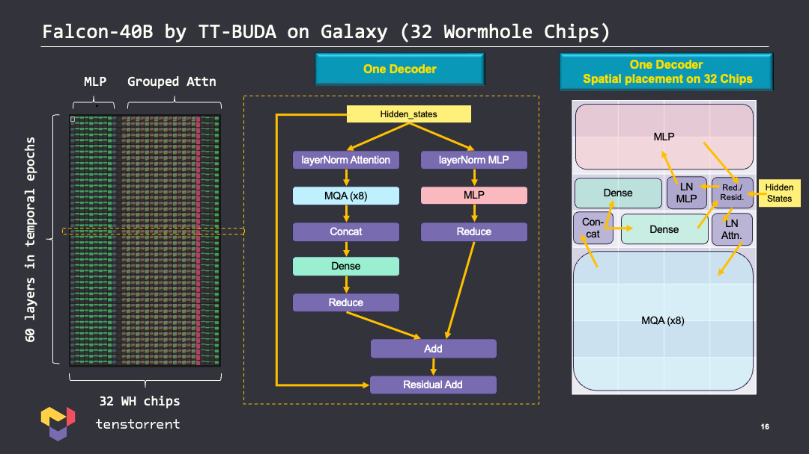
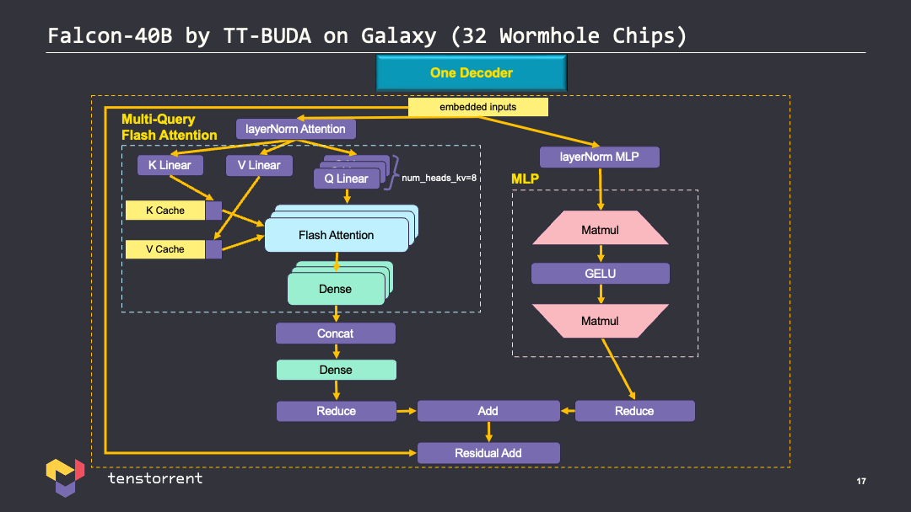

# Backend Overview

`decode_backend_v1.py` initializes `DecodeBackend` (see section below for detials) and runs an endless event loop in `run_generate` to:
1. `pick_prompts`: add prompts from `input_queue` to user rows for generation when capacity is available. Prompts are tokenized into token ids and prompt metadata is stored in `UserInfo` object.
2. `prepare_inputs`: pre-process input prompts tokens into:
    * input_ids:          1x32, predictions (long)
    * prompt_tokens:      32xseqlen padded prompts (long)
    * position_ids:       1x32 (long) tensor of position_ids for the currently generated token
    * prompt_lengths:     32, tensor of number of tokens in each prompt
    * attention_mask:     1x32x2048
    * kv_mask_id:         1x32
3. `decode`: run generation on all user rows in parallel, calls self.model.main_forward_part(...) details in DecodeBackend section below.
4. `switch_tokens`: manages next token selection for:
    * prefill: select next token in prompt_tokens
    * generation: select next generated token
    * cancelation: send EOS token
5. `push_outputs`: output generated tokens decoded to string to `output_queue`
6. `update_users`: remove user prompts from user rows upon EOS token.
7. `send_status`: put status information (input_queue.qsize(), num_users) in `status_queue`

## Galaxy Falcon 40B Placement

The following diagram shows the placement of Falcon 40B with:
* 60 layers each broken into a separate epoch
* Multi-query flash attention (MQA) fractured across 16 wormhole chips/modules
* MLP fractured across 8 wormhole chips/modules



## Decoder layer

Falcon uses a decoder only architecure, the decoder uses the following modifications from
original multi-head (scaled dot-product) attention:
 
* Flash Attention
* Rotary Positional Embedding (RoPE)
* Multi-Query Attention
* Parallel Attention and Feed-Forward (MLP) Layers



# FAQ

## how are user rows different than batch dimension?

user rows is an extra dimension added, similar to batching, to increase throughput. The difference with user rows is it is fixed at 32 and optimized for the memory and compute utilization of Galaxy. The on device KV (Key Value) cache is stored in SRAM.

## How is KV cache managed and input to Galaxy device?

The KV cache is initialized and stored in host memory (RAM) within `DecodeBackend.past_key_values` as tuple(list[num_batch, user_rows, seqlen, head_dim], list[num_batch, user_rows, seqlen, head_dim]). The length of the lists is num_kv_head. The K and V caches are therefore each torch.Size([1, 32, 2048, 64, 8]) at float16b (2 Bytes each), this is 64 MB, 128 MB for both K and V caches. Thats 7680 MB total for all 60 layers, just shy of 8 GB in total. 

The current Galaxy placement has Multi-Query Flash Attention layers are fractured onto 16 chips (Galaxy modules) with SRAM of 120 MB x 16 = 1920 MB, however the model is broken into 1 layer per epoch, so only 128 MB is needed for the KV cache per layer.

## Placement and SRAM usage

With 1 epoch per layer, parameters are roughly 83.5 GB / 60 = 1.4 GB. As mentioned previous KV cache is 128 MB.

# Current Implementation

The code has several paths that allow for configuration of different compute graphs. The performance optimized version currently chosen for deployment in the Falcon 40B inference API is described below.

## Initialization

1. `DecodeBackend` is initialized with arguments passed directly from frontend Flask server call using `multiprocessing.Process(...)`.
Important arguments currently used from deployment:

* Sequence Length (seqlen): 2048
* User Rows : 32
* Batch : 1
* max_users: 32 (equivalent to user rows)
* version: "efficient-40b" (defines which compute graph to use)
* fracture_vocab: True
* od_lm_head: True
* num_kv_heads: 8

Complete dictionary of args:
```python
{'amp_level': None,
 'arch': 'nebula-galaxy',
 'batch_size': 1,
 'device': 'silicon',
 'enable_tvm_cache': True,
 'flash_decode': True,
 'fracture_attn': 0,
 'fracture_mlp': 8,
 'fracture_vocab': True,
 'fracture_vocab_factor': 8,
 'fuse': False,
 'hf_cache': '/proj_sw/large-model-cache/falcon40b/hf_cache',
 'host_queues': False,
 'load': None,
 'load_pretrained': True,
 'load_weights': False,
 'load_weights_dir': 'falcon40b.pt',
 'log_level': 'ERROR',
 'mode': 'concurrent',
 'model': 'tiiuae/falcon-40b-instruct',
 'multi_chip_placer': 'parallel',
 'net_name': '',
 'num_chips': 32,
 'num_layers': 60,
 'num_outer_loops': 1000,
 'num_tokens': 1000000,
 'od_lm_head': True,
 'opt_level': 4,
 'output_at_end': False,
 'padded_lm_head': True,
 'perf': None,
 'place': 'none',
 'precision': 'bf16',
 'print_interval': 1,
 'print_option': 'reprint',
 'prompts_file': 'data/multi_prompt.json',
 'queues_on_host': False,
 'save': None,
 'save_weights': False,
 'save_weights_dir': 'falcon40b.pt',
 'seqlen': 2048,
 'skip_lm_head': False,
 'stop': '\n\n',
 'temperature': 1.0,
 'top_k': 5,
 'top_p': 0.9,
 'user_rows': 32,
 'verify': False,
 'version': 'efficient-40b'}
```

2. `DecodeBackend.__init__()`: `load_model_and_tokenizer` which initializes model and tokenizer:
    * self.model.config initialized `from tt_models.falcon40b.configuration_RW import RWConfig`:
```python
RWConfig {
  "_name_or_path": "tiiuae/falcon-40b-instruct",
  "alibi": false,
  "apply_residual_connection_post_layernorm": false,
  "architectures": [
    "FalconForCausalLM"
  ],
  "attention_dropout": 0.0,
  "auto_map": {
    "AutoConfig": "tiiuae/falcon-40b-instruct--configuration_falcon.FalconConfig",
    "AutoModel": "tiiuae/falcon-40b-instruct--modeling_falcon.FalconModel",
    "AutoModelForCausalLM": "tiiuae/falcon-40b-instruct--modeling_falcon.FalconForCausalLM",
    "AutoModelForQuestionAnswering": "tiiuae/falcon-40b-instruct--modeling_falcon.FalconForQuestionAnswering",
    "AutoModelForSequenceClassification": "tiiuae/falcon-40b-instruct--modeling_falcon.FalconForSequenceClassification",
    "AutoModelForTokenClassification": "tiiuae/falcon-40b-instruct--modeling_falcon.FalconForTokenClassification"
  },
  "batch_users": false,
  "bias": false,
  "bos_token_id": 11,
  "efficient_40b": true,
  "eos_token_id": 11,
  "flash_decode": true,
  "fracture_vocab": true,
  "hidden_dropout": 0.0,
  "hidden_size": 8192,
  "initializer_range": 0.02,
  "layer_norm_epsilon": 1e-05,
  "model_type": "RefinedWeb",
  "n_head": 128,
  "n_head_kv": 8,
  "n_layer": 60,
  "new_decoder_architecture": true,
  "num_kv_heads": 8,
  "padded_lmh": true,
  "parallel_attn": true,
  "split_mq": false,
  "torch_dtype": "bfloat16",
  "transformers_version": "4.33.2",
  "use_cache": true,
  "user_rows": 32,
  "vocab_size": 65024
}
```
* self.model initialized `from tt_models.falcon40b.tt_modeling_RW import RWForCausalLM as RWForCausalLMTT`
    * `self.transformer = RWModel(config)`
* `model.transformer.split_qkv_wqkv_weights()`
    * h.self_attention.split_qkv_weights()
        * load wq, wk, wv from `self.query_key_value` 
    * h.self_attention.split_group_qkv_proj()
        * defines:
            * self.wq_list: nn.ModuleList(Linear)
            * self.wk_list: nn.ModuleList(Linear)
            * self.wv_list: nn.ModuleList(Linear)
            * self.dense_list: nn.ModuleList(Linear)
    * defines `self.blocks` -> `SequentialCaller`
* `model.set_padded_lmh(padding=512)`
    * allows us to pad the vocab size to a power of 32, which is better for picking good grid sizes in hardware.
* `model.fracture_vocab(fracture_factor=args.fracture_vocab_factor), default=8`
    * fractued the LM head into 8 groups, which was necessary at the time - it was not possible for us to concatenate all fractures of the LM head together, so it is split into 8 groups which are each fractured, and then return the groups for the host to concatenate.
* `model.transformer.put_lm_head_on_device(model.lm_head)`
    * `self.norm = ln_f`,
    * `self.lm_head = lm_head`
    * add LM head to end of compute graph to create logits, otherwise a NOP is used as the LM head.

3. `DecodeBackend.__init__()`: KV Cache initialization:
    * `self.past_key_values = self._init_kv_cache()`
    * past_key_values is a tuple(list[key, value]) tensors, one for each layer, length of list is 16 (8 + 8) * n_layers = 960 (for 60 layers), where 8 is the n_head_kv for each key and value, giving each of shape: torch.Size([1, 32, 2048, 64]), [batch_dim, user_rows, seqlen, 64] of dtype bfloat16.
    * `self.past_key_values` at this point is all zeros and stored on the host device in DRAM.

4. `DecodeBackend.__init__()`: _post_init_pybudify
    * calls `self.model.transformer.blocks = PyBudify(...)` from `pybudify40.py` passing args
        * initialize `DecodeConfig`
        * set TT device placement overides: `decode_config.placement_overrides(...)`
        * define `__call__` to call `self.pybuda.run_generate` and reshape output
    * set environment vars for pybuda and BBE:
```python
        os.environ["PYBUDA_MICROBATCH_LOOPING"] = "1"
        os.environ["TT_BACKEND_DRAM_POLLING_FREQUENCY"] = "64"
        os.environ["PYBUDA_DEVICE_EMBEDDINGS"] = "1"
        os.environ["TT_BACKEND_ALLOW_RUNTIME_RECOMPILE"] = "1"
        os.environ["TT_BACKEND_COMPILE_THREADS"] = "32"
```

## Generation

The generation is run in a loop, generating a single token output per user_row.

1. Within `decode` generation runs via:
```python
outputs = self.model.main_forward_part(
    self.input_ids,
    position_ids=self.position_ids,
    attention_mask=self.attention_mask,
    kv_mask_id=self.kv_mask_id,
    past_key_values=self.past_key_values,
    profile_runtime=False,
    on_device_lm_head=True,
)
```
2. The model defintion `RWForCausalLM` in `tt_modelint_RW.py` gives a direct pass through to `self.transformer`:
```
transformer_outputs = self.transformer(
    input_ids,
    past_key_values=past_key_values,
    attention_mask=attention_mask,
    kv_mask_id=kv_mask_id,
    head_mask=head_mask,
    inputs_embeds=inputs_embeds,
    output_hidden_states=output_hidden_states,
    return_dict=return_dict,
    position_ids=position_ids,
    profile_runtime=profile_runtime,
    on_device_lm_head=on_device_lm_head,
)
```
`RWModel` is a subclass of `RWPreTrainedModel` -> `PreTrainedModel` where `__call__` -> `self.forward`
```python
outputs = self.blocks(
    hidden_states, cos, sin, attention_mask, *flattened_kv, kv_mask_id
)
```
* hidden_states: `inputs_embeds = self.word_embeddings(input_ids)`, torch.Size([1, 32, 8192])
* cos, sin: `cos, sin = self.rotary_emb()`, torch.Size([1, 1, 32, 64])
* attention_mask: pass through, torch.Size([1, 32, 16, 2048])
* flattened_kv: list[torch.Size([1, 32, 2048, 64])], (8 + 8) * 60 = 960, for 8 keys, 8 values, and 60 layers.
* kv_mask_id: pass through, torch.Size([1, 2048])

3. calls `SequentialCaller.forward`:

`layer_past = past_key_values[i * 16 : (i + 1) * 16]` <br>
layer_past: tuple(torch.Size([1, 32, 2048, 64])), len = 16

kv_read_mask: torch.Size([1, 32, 2048, 64]) <br>
kv_write_mask: torch.Size([1, 32, 2048, 64]) <br>

```python
for i, block in enumerate(self.layers):
    result = []
    output, key_past, value_past = block(
        hidden_states,
        layer_past=layer_past,
        attention_mask=attention_mask,
        kv_read_mask=kv_read_mask,
        kv_write_mask=kv_write_mask,
        cos=cos,
        sin=sin,
    )
    ...
    result.extend(key_past + value_past)
    ...
    result.insert(0, hidden_states)
    return tuple(result)
```

4. calls `DecoderLayer.forward`
```
DecoderLayer(
  (ln_attn): LayerNorm((8192,), eps=1e-05, elementwise_affine=True)
  (ln_mlp): LayerNorm((8192,), eps=1e-05, elementwise_affine=True)
  (self_attention): Attention(
    (query_key_value): None
    (dense): None
    (attention_dropout): Dropout(p=0.0, inplace=False)
    (wq): None
    (wk): None
    (wv): None
    (wq_list): ModuleList(
      (0-7): 8 x Linear(in_features=8192, out_features=1024, bias=False)
    )
    (wk_list): ModuleList(
      (0-7): 8 x Linear(in_features=8192, out_features=64, bias=False)
    )
    (wv_list): ModuleList(
      (0-7): 8 x Linear(in_features=8192, out_features=64, bias=False)
    )
    (dense_list): ModuleList(
      (0-7): 8 x Linear(in_features=8192, out_features=1024, bias=False)
    )
  )
  (mlp): MLP(
    (dense_h_to_4h): Linear(in_features=8192, out_features=32768, bias=False)
    (act): GELU(approximate='none')
    (dense_4h_to_h): Linear(in_features=32768, out_features=8192, bias=False)
  )
)
```

```python
        ln_attn = self.ln_attn(hidden_states)
        ln_mlp = self.ln_mlp(hidden_states)
        residual = hidden_states

        attention_output, key_past, value_past = self.self_attention(
            ln_attn,
            layer_past=layer_past,
            attention_mask=attention_mask,
            head_mask=head_mask,
            output_attentions=output_attentions,
            cos=cos,
            sin=sin,
            kv_read_mask=kv_read_mask,
            kv_write_mask=kv_write_mask,
        )
        mlp_output = self.mlp(ln_mlp)

        mlp_output += attention_output

        output = dropout_add(
            mlp_output, residual, self.config.hidden_dropout, training=self.training
        )

        return output, key_past, value_past
```
5. Flash Attention:
self.self_attention() -> Attention.forward() -> return self.efficient_forward_flash_decode()

* queries: list[torch.Size([1, 32, 16, 64])], len = 8 (num_kv), [batch, users, num_heads, head_dim]
* keys: list[torch.Size([1, 32, 1, 64])], len = 8 (num_kv), [batch, users, 1, head_dim]
* values: list[torch.Size([1, 32, 1, 64])], len = 8 (num_kv), [batch, users, 1, head_dim]
* keys_cache: tuple(torch.Size([1, 32, 2048, 64])), len = 8 (num_kv), [batch, users, seq_len, head_dim]
* values_cache: tuple(torch.Size([1, 32, 2048, 64])), len = 8 (num_kv), [batch, users, seq_len, head_dim]
* attention_mask: torch.Size([1, 32, 16, 2048]), [batch, users, n_head, seq_len]

`keys` and `values` here represent the current next tokens while the caches contain the keys and values for previous `seqlen=2048`.

__Note__: this is where new `keys` and `values` are computed:

```python
        queries = []
        keys = []
        values = []
        for i in range(self.num_kv):
            query = (
                self.wq_list[i](hidden_states)
                .reshape(num_batch, users, -1, self.head_dim)
                .transpose(1, 2)
            )  # [batch, group, users, head_dim]
            query = apply_rotary_pos_emb_q(query, cos, sin)
            queries.append(query.transpose(1, 2))  # [batch, users, group, head_dim]

            key = self.wk_list[i](hidden_states).reshape(
                num_batch, 1, users, self.head_dim
            )  # [batch, 1, users, head_dim]
            key = apply_rotary_pos_emb_k(key, cos, sin)
            keys.append(key.transpose(1, 2))  # [batch, users, 1, head_dim]

            value = self.wv_list[i](hidden_states).reshape(
                num_batch, users, 1, self.head_dim
            )  # [batch, users, 1, head_dim]
            values.append(value)
```

The new `keys` and `values` are masked (`kv_read_mask` and `kv_write_mask`) and merged with `keys_cache` and values_cache respectively, however this is done __independently__ of the `flash_decode_attention` implementation which has inputs of `Ks=[keys_cache[i], keys[i]],`. This is because the specialized implementation of `flash_decode_attention`.

__Specialized flash_decode_attention__: The original FlashAttention does (QK^T)V sequentially using a fused kernel. Instead of doing the this sequentially, we applied FlashAttention principles in a specialized version for Tenstorrent hardware to:
    1. first gather all stats from QK^T in one loop, and do another for loop for the V matmul
    2. split attention into two parts: new attention, and cache attention, i.e. acting on keys_cache[i] and keys[i]

This improves performance because updating the KV cache with both a new K and new V before doing attention was a large data dependency and created a bottleneck.

```python
        keys_cache = layer_past[:8]
        values_cache = layer_past[8:]
        ...
        attn_outputs = [
            TT_functional.flash_decode_attention(
                Q=queries[i],
                Ks=[keys_cache[i], keys[i]],
                Vs=[values_cache[i], values[i]],
                attn_masks=[attention_mask, None],
            )
            for i in range(self.num_kv)
        ]
```

Finally `efficient_forward_flash_decode` returns `output_tensor`, `keys_merged`, `values_merged`.
Tracing back up the call execution stack:
1. `DecoderLayer.forward`
    `output_tensor`, `keys_merged`, `values_merged` are mapped to: `attention_output`, `key_past`, `value_past`, and `attention_output` is further processed into `output`.
2. `SequentialCaller.forward`
    `output`, `key_past`, `value_past` are all packed into `result` in the format: result = [hidden_states, key_past + value_past]
