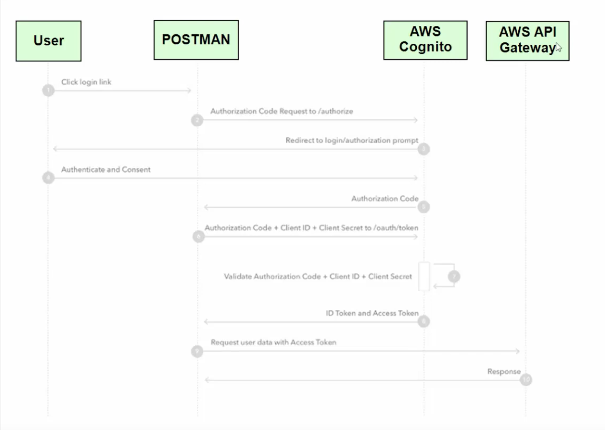
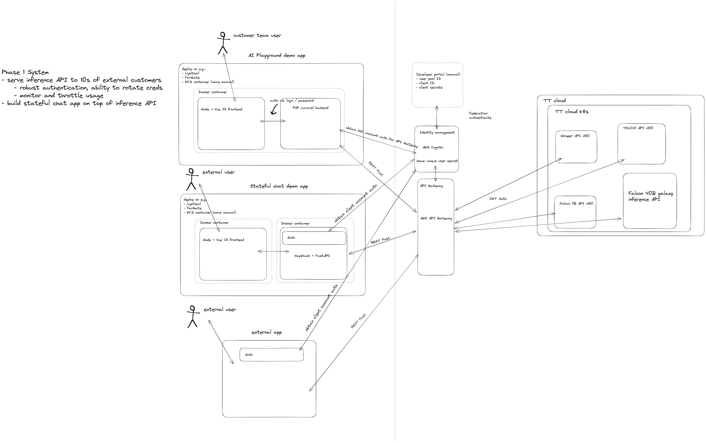

# API Access controls

## AWS Cognito Authentication and Authorization for applications

1. Users can log in via email / password (includes password reset flow via email). Applications alternatively also use a fixed login account for the application and call the Cognito API without the login page UI if they want to have an independent login flow. This is expected for customer applications. Internal applications can leverage the Cognito login UI for specific users.
2. Calls must send the header "Authorization" with the value being the access_token.

In the diagram below the "application" is Postman.

## AWS API Gateway 

1. Verify user authorization in AWS cognito to access API resource
    * Use Cognito user pools for each API resource
2. Route external requests to API Gateway external URL to internal API backend URL
3. Specify maximum usage threshold for each user

For further details see: https://docs.aws.amazon.com/apigateway/latest/developerguide/apigateway-rest-api.html

